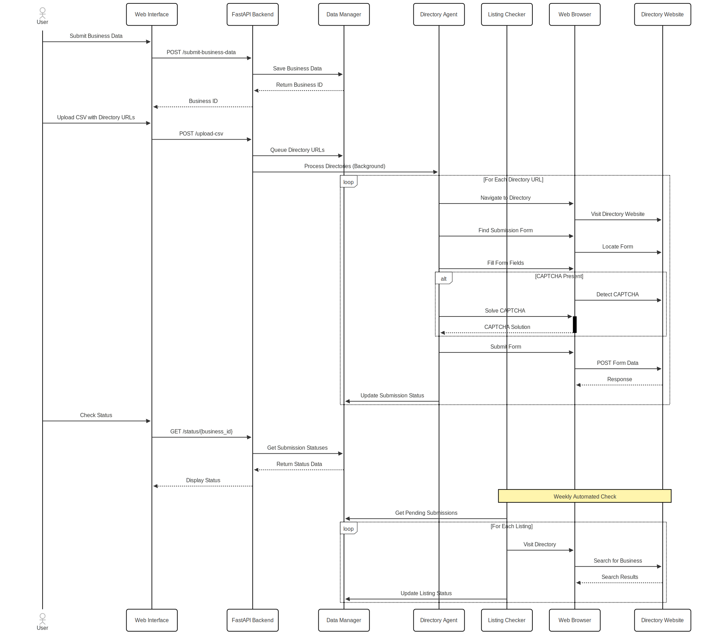

# SEO Directory Submission Agent

A robust, AI-powered agent for automating SEO directory submissions for startups and businesses.

## Project Overview

The SEO Directory Submission Agent automates the tedious process of manually submitting business information to various web directories for SEO purposes. This agent handles the entire process, from collecting business data to filling out complex submission forms, managing logins, handling CAPTCHAs, and tracking submission status.

## Features

- **Business Data Collection**: One-time collection of all necessary business information
- **CSV URL Processing**: Parse submission directory URLs from a CSV file
- **Web Automation**: Visit directories, detect forms, fill them with appropriate data
- **Form Intelligence**: Smart mapping of business data to various form field types
- **CAPTCHA Handling**: Integration with CAPTCHA solving services (2Captcha)
- **Submission Tracking**: Monitor and track status of all directory submissions
- **Weekly Verification**: Automatically verify if listings are live on a weekly basis

## Architecture

The project follows a modular design with these core components:

- **Main API (FastAPI)**: Handles requests, scheduling, and business logic orchestration
- **Data Manager**: Manages business data and submission status persistence
- **Directory Agent**: Performs the actual web automation and form submission
- **Listing Checker**: Verifies if listings are live on directories
- **Web UI**: Simple interface for users to interact with the system

### Architecture Diagram


### Process Flow



## Technical Implementation

### Technology Stack

- **Backend**: Python with FastAPI
- **Web Automation**: Playwright
- **Database**: SQLite (easily upgradable to PostgreSQL/MongoDB)
- **Scheduling**: APScheduler for recurring tasks
- **CAPTCHA Solving**: Integration with 2Captcha API
- **Frontend**: HTML, CSS, JavaScript (vanilla)

### Key Components

#### 1. Data Manager (`data_manager.py`)
- Handles database operations for business data and submission tracking
- Uses SQLite for easy setup, can be upgraded to a more robust DB

#### 2. Directory Agent (`directory_agent.py`)
- Core automation component that handles web interactions
- Features intelligent form field detection and mapping
- Handles login procedures and CAPTCHA solving

#### 3. Listing Checker (`listing_checker.py`)
- Weekly verification of submission status
- Searches directories to check if business listings are live

#### 4. Web Interface (`static/index.html`)
- Simple UI for inputting business data and monitoring status
- Responsive design for both desktop and mobile use

## Setup and Installation

1. Clone the repository
```bash
git clone https://github.com/yourusername/seo-directory-agent.git
cd seo-directory-agent
```

2. Create a virtual environment and install dependencies
```bash
python -m venv venv
source venv/bin/activate  # On Windows: venv\Scripts\activate
pip install -r requirements.txt
```
3. Set up environment variables (for CAPTCHA service, if using)
```bash
cp .env.example .env
# Edit .env with your CAPTCHA API key
```

4. Run the application
```bash
uvicorn main:app --reload
```

6. Access the web interface at `http://localhost:8000`

## Usage

1. **Enter Business Information**:
   - Fill out the form with all required business details
   - Submit to save the information

2. **Upload Directory URLs**:
   - Prepare a CSV file with one directory URL per line
   - Upload the CSV to queue submissions

3. **Monitor Status**:
   - Check the Status tab to see submission progress
   - View which submissions succeeded or failed

4. **Verify Listings**:
   - Use the "Check Listings" button to verify if directories have published your listing
   - The system also automatically checks weekly

## Scaling to Hundreds of Directories

To scale this solution to handle hundreds of directories efficiently:

1. **Worker Pool Implementation**:
   - Add a distributed task queue using Celery with Redis/RabbitMQ
   - Deploy multiple workers to process directory submissions in parallel

2. **Proxy Rotation System**:
   - Implement IP rotation to avoid rate limiting
   - Integrate with proxy providers for clean IPs

3. **Database Upgrades**:
   - Migrate from SQLite to PostgreSQL for concurrent operations
   - Add indexes for performance optimization

4. **Template Classification**:
   - Build a ML model to classify directory form types
   - Create tailored submission strategies for common directory platforms

5. **Error Recovery System**:
   - Add sophisticated retry logic with exponential backoff
   - Implement form state persistence for recovery after failures

6. **Monitoring & Alerting**:
   - Add Prometheus metrics for system health
   - Implement email/Slack alerts for critical issues

7. **Auto-scaling Infrastructure**:
   - Deploy on Kubernetes for auto-scaling capabilities
   - Scale workers based on queue depth

## Future Enhancements

- **Business Profile API**: Allow integration with business CRM systems
- **Directory Effectiveness Rating**: Track which directories provide the most value
- **Submission Templates**: Create templates for common directory platforms
- **Dashboard Analytics**: Visualize submission and listing performance
- **AI-powered Form Detection**: Use ML to improve form field mapping

## Limitations and Considerations

- **CAPTCHA Challenges**: Some directories implement sophisticated anti-bot measures
- **Directory Changes**: Directory websites can change, breaking automation
- **Rate Limiting**: Directories may block IPs that make too many requests
- **Ethical Considerations**: Always respect robots.txt and terms of service
